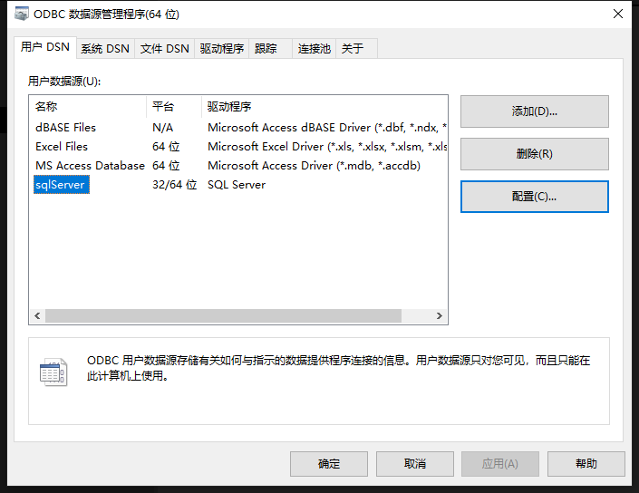
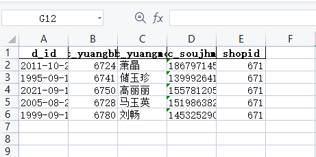
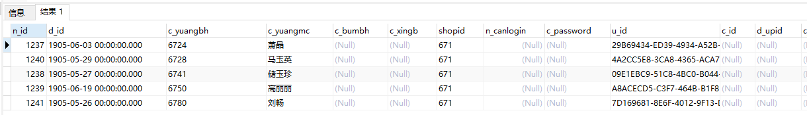

# 随机数据生成
使用Faker生成随机数据，导出Excel多次使用、向数据库插入生成的数据等比生成环境

## 配置ODBC数据源

配置方法可自行百度

## 安装依赖
`pip install Faker`  
`pip install Pandas`  
`pip install Pyodbc`  

## 配置数据库信息
`
getsql = Pysql('SQL Server',
                   '服务器地址',
                   '用户名',
                   '密码',
                   '数据库名称')
                   `

## 预览
导出Excel  

插入数据库  

